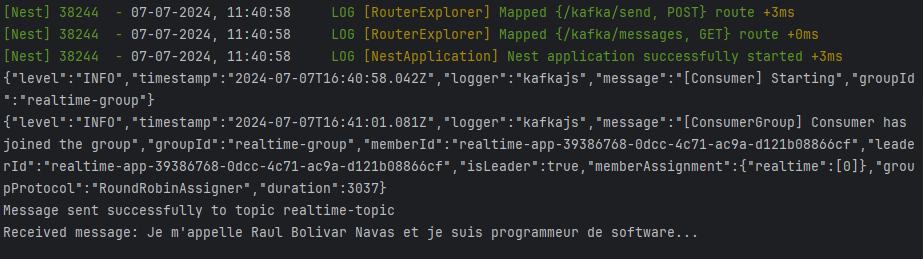

# online-store-infrastructure

Infrastructure solution project for an online product store, with NestJS, React, Kafka...


- Create a KAKFA cluster:
    - `docker-compose -f docker-compose.yml up -d`        
  

- Create a KAFKAJS microservice:
    - `cd kafka-js`
    - `npm install`
    - `npm run start:dev`
  ```bash
    curl --location 'http://localhost:3000/kafka/send' 
      --header 'Content-Type: application/json' 
      --data '{ 
        "message": "Je m'\''appelle Raul Bolivar Navas et je suis programmeur de software... "
      }'
  ```
  
    
  

  ```bash
    curl --location 'http://localhost:3000/kafka/messages'
  ```  
  

---
@RASYSBOX | 2024
